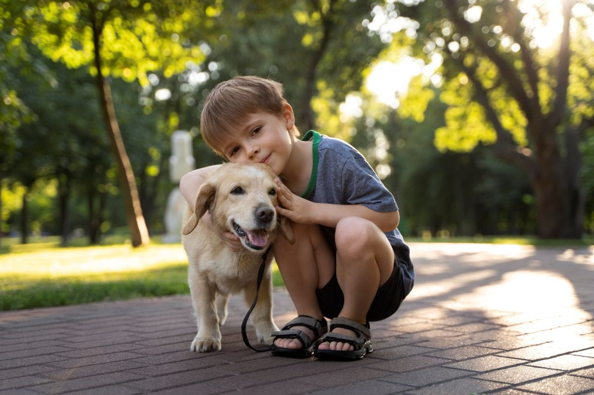

# Detecção de Objetos em Tempo Real com YOLOv8

 
*(Dica: Após rodar seu código, tire um print do resultado e substitua a imagem `photo.jpg` por essa imagem com as detecções para um visual mais impactante!)*

---

## 📖 Sobre o Projeto

Este projeto demonstra a aplicação prática do modelo **YOLOv8**, um dos mais avançados algoritmos de detecção de objetos em tempo real. O objetivo foi estudar e implementar um pipeline de Visão Computacional para identificar e classificar múltiplos objetos em imagens, utilizando Python e o ecossistema PyTorch.

O processo envolve desde a verificação e configuração do ambiente para uso de GPU (CUDA) até a execução do modelo pré-treinado em imagens de amostra para visualização dos resultados.

## 🛠️ Tecnologias Utilizadas

- **Linguagens:** Python 3.9+
- **Bibliotecas Principais:**
  - `Ultralytics (YOLOv8)`
  - `PyTorch`
  - `OpenCV-Python`
  - `Jupyter Notebook`

## 🚀 Como Executar o Projeto

Para executar este projeto localmente, é recomendado o uso de um ambiente virtual Conda para gerenciar as dependências.

**Pré-requisitos:**
- Git
- Anaconda ou Miniconda

**Passo a Passo:**

1.  **Clone o repositório:**
    ```bash
    git clone [https://github.com/](https://github.com/)[SEU_USUARIO]/[NOME_DO_REPOSITORIO].git
    ```

2.  **Navegue até a pasta do projeto:**
    ```bash
    cd [NOME_DO_REPOSITORIO]
    ```

3.  **Crie e ative o ambiente Conda:**
    ```bash
    # Crie o ambiente a partir do arquivo de requisitos
    conda create --name yolo_env python=3.9
    conda activate yolo_env
    ```

4.  **Instale as dependências:**
    ```bash
    pip install -r requirements.txt
    ```

5.  **Execute os Notebooks:**
    Abra o Jupyter Notebook e execute os arquivos na pasta `notebooks/` na seguinte ordem:
    - `0_verificacao_ambiente.ipynb`: Para garantir que o PyTorch está reconhecendo sua GPU.
    - `1_deteccao_em_imagens.ipynb`: O script principal que executa a detecção nos arquivos da pasta `sample_images/`.

## 🙏 Agradecimentos e Fonte de Inspiração

Este projeto foi desenvolvido como parte dos meus estudos em Visão Computacional. A inspiração inicial e a base de conhecimento foram extraídas da excelente aula **[Nome da Aula ou do Vídeo]** do canal **[Nome do Canal no YouTube]**. A partir deste ponto de partida, foquei na estruturação do projeto, na gestão do ambiente e na documentação do processo de forma profissional.
